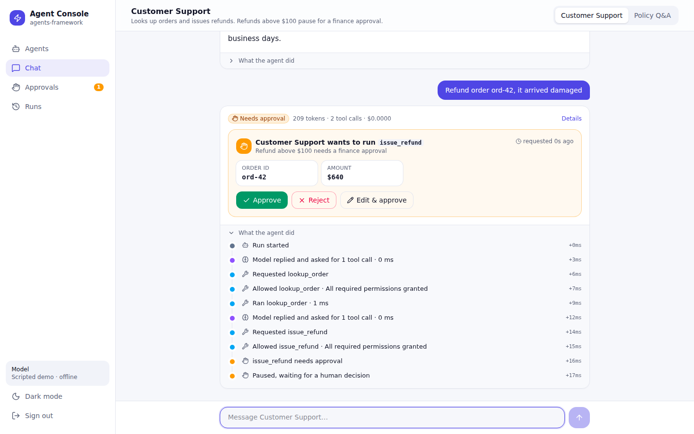

# Agent Console

A web console for [agents-framework](https://github.com/agent-farmework/agents-framework): chat with
agents, approve risky actions, watch each step live, and review every run with its tool audit and cost.



## What it does

| Screen | What you can do |
| --- | --- |
| **Agents** | See each agent's tools, which actions need approval, its protections and limits |
| **Chat** | Talk to an agent; its steps stream live under the answer (model, tools, approvals, guardrails, knowledge) |
| **Approvals** | Approve, reject (with a reason) or edit-and-approve paused actions. Approving twice still runs once. |
| **Runs** | History with status, tokens and cost; a detail page with the full timeline and tool audit |

Two demo agents run on the framework's offline scripted model (no API key):

- **Customer Support** looks up orders and issues refunds. Refunds above $100 pause for approval. It redacts personal data and blocks prompt injection.
- **Policy Q&A** answers from policy documents and cites the source it used, with a citation check.

## Stack

- **Server:** Node 22 + [Hono](https://hono.dev), in `server/`. Uses `@agent-farmework/*` directly. One SQLite file holds run state (the framework's `SqliteRunStateStore`, including the atomic approval claim), events and the audit log. Live steps are sent to the browser with Server-Sent Events.
- **UI:** React 19 + Vite + Tailwind 4, in `web/`. Light and dark themes, phone layout, keyboard and screen-reader labels.
- **Login:** a single admin password (`ADMIN_PASSWORD`), an HttpOnly SameSite=Strict session cookie, and login rate limiting.

## Run it

Requires Node 22.5+ and pnpm 10 (`corepack enable`).

```bash
git clone --recurse-submodules https://github.com/Abdelrahman-sadek/agent-console.git
cd agent-console
pnpm run setup                    # builds the agents-framework submodule, then installs
pnpm test                         # API tests
pnpm build                        # typecheck and build the UI into dist/web
ADMIN_PASSWORD='choose-a-long-one' pnpm start   # http://127.0.0.1:3000
```

For development, run `pnpm dev:server` (password `demo`) and `pnpm dev:web` (http://localhost:5173, proxies `/api`).

| Variable | Default | |
| --- | --- | --- |
| `ADMIN_PASSWORD` | `demo` in dev; **required** (8+ chars) in production | Console login |
| `PORT` / `HOST` | `3000` / `127.0.0.1` | Put Nginx or Caddy in front for HTTPS |
| `DATABASE_PATH` | `data/console.db` | SQLite file |
| `INSECURE_COOKIES` | unset | Set to `1` only for local HTTP testing in production mode |

### Framework dependency

[agents-framework](https://github.com/agent-farmework/agents-framework) is included as a git submodule in
`vendor/agents-framework`, pinned to the commit that contains the security fixes from
[PR #6](https://github.com/agent-farmework/agents-framework/pull/6). To update it:

```bash
git -C vendor/agents-framework fetch origin main && git -C vendor/agents-framework checkout origin/main
pnpm run setup && pnpm test && git add vendor/agents-framework && git commit -m "Update agents-framework"
```

Once the framework is published to GitHub Packages, the `link:` dependencies in `package.json` can be
replaced with version numbers and the submodule removed.

## Verified

- CI runs the tests and build on every push (`.github/workflows/ci.yml`).
- `pnpm test`: 5/5 API tests, covering login and 401s, a small refund running automatically, a large refund
  waiting and then approved once while a concurrent second approval gets 409, a rejected refund not being
  issued, an injection being blocked, and a cited answer with the email redacted.
- A browser walkthrough against the production build, captured in `screenshots/` (01–10): light, dark and
  phone (390px, no horizontal scroll).

## Next

- Deploy to a server behind HTTPS.
- Switch to a real model: add `@agent-farmework/provider-anthropic` and select it with an environment variable.
